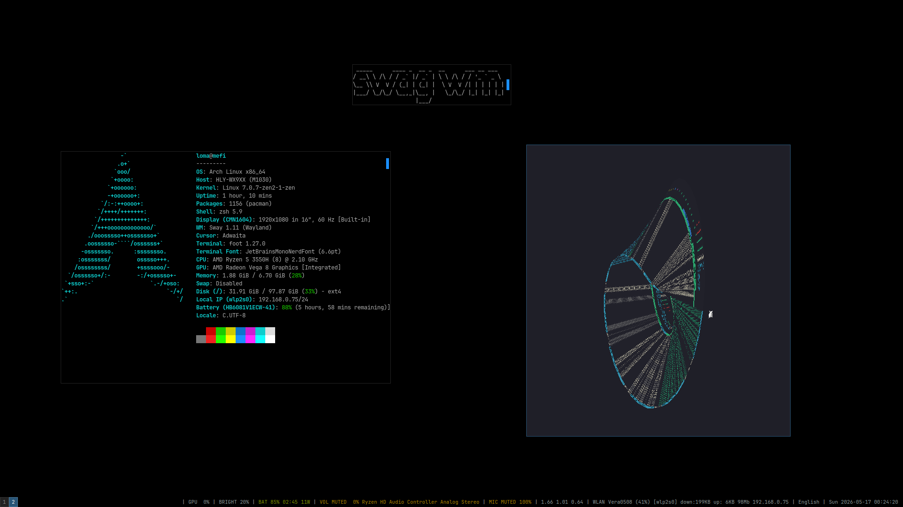
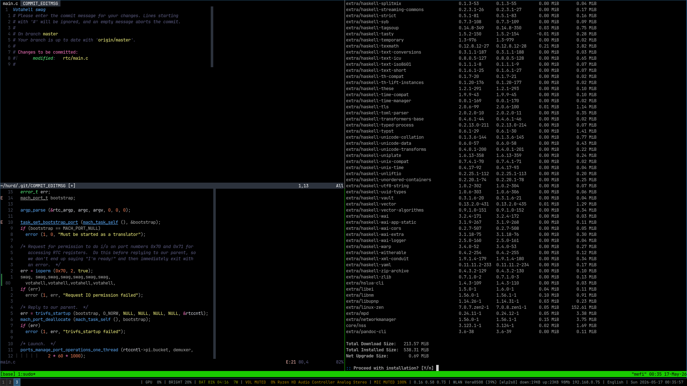
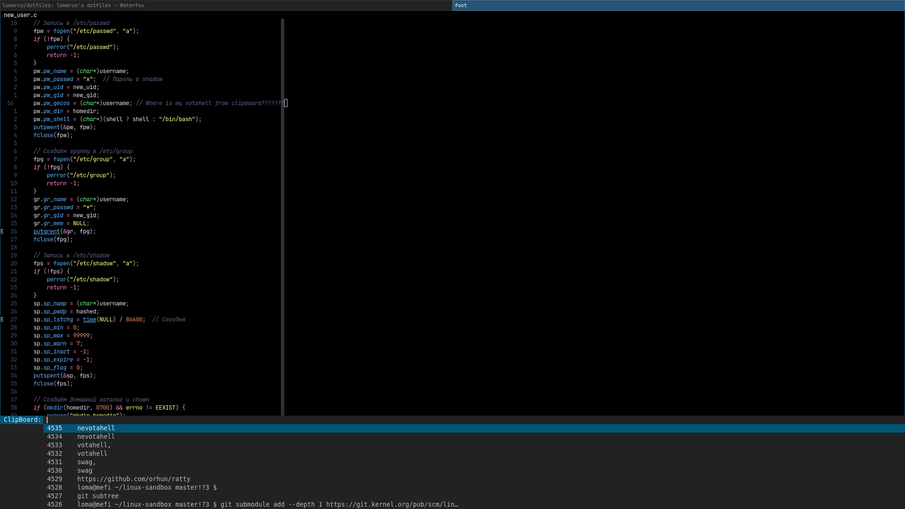

# Lomarco's Dotfiles

<p align="center">
  
</p>

<details open>
  <summary>Contents</summary>

- [Toolchain](#toolchain)
- [Gallery](#gallery)
- [Repository Structure](#repository-structure)
  - [Base](#base)
  - [Scripts](#scripts)
- [Install Guide](#install-guide)
- [Sway Hotkeys](#sway-hotkeys)
- [NeoVim Config](#Neovim-config)
- [License](#license)

</details>

## Toolchain
|                |                |
|----------------|----------------|
| ***Window Manager*** | [***`Sway`***](https://swaywm.org) |
| ***Status Bar*** | [***`Swaybar & I3status-Rust`***](https://github.com/greshake/i3status-rust) |
| ***Terminal*** | [***`Foot`***](https://codeberg.org/dnkl/foot) |
| ***Shell*** | [***`Zsh & Rac`***](https://github.com/lomarco/rac) |
| ***Editor*** | [***`NeoVim`***](https://neovim.io) |
| ***Multiplexer*** | [***`Tmux`***](https://github.com/tmux/tmux/wiki) |
| ***Password Manager*** | [***`Pass`***](https://www.passwordstore.org) |
| ***WiFi Manager*** | [***`Network Manager`***](https://networkmanager.dev) |
| ***Notification Manager*** | [***`Fnott`***](https://codeberg.org/dnkl/foot) |
| ***File Manager*** | [***`Yazi`***](https://yazi-rs.github.io) |
| ***Pdf Reader*** | [***`Zathura`***](https://pwmt.org/projects/zathura) |
| ***Notes Manager*** | [***`Noca`***](https://github.com/lomarco/noca) |
| ***Bootloader*** | [***`EFI Stub`***](https://github.com/lomarco/dotfiles/blob/master/bin/efistub-boot) |

## Gallery

<p align="center">
  
  <br />
  
</p>

## Repository Structure

### [base-packages](base-packages) - List of base packages.
### [base-aur-packages](base-aur-packages) - List of base aur packages.
### [extra-packages](extra-packages) - List of extra packages.
### [extra-aur-packages](extra-aur-packages) - List of extra aur packages.
### [arch](arch) - /etc/ directory for arch.
### [nixos](arch) - /etc/nixos/ directory for nixos.

### Home

- [Sway](home/.config/sway/config)
- [I3status-Rust](home/.config/i3status-rust/config.toml)
- [Foot](home/.config/foot/foot.ini)
- [Zsh](home/.zshrc)
- [NeoVim](home/.config/nvim/init.lua)
- [Tmux](home/.config/tmux/tmux.conf)
- [Vim](home/.vimrc)
- [Git config](home/.gitconfig)

### Scripts

- [auto\_backup](bin/auto_backup)
- [efistub-boot](bin/efistub-boot)
- [aupa](bin/aupa)
- [crpt\_price](bin/crpt_price)


## Install Guide
Init and update submodules:
```bash
git submodule update --init --recursive
```

Update to latest changes:
```bash
git submodule update --remote
```

Install and select configs (home config for example. See `make help` for information):
```bash
make home
```

list packages from file
``` bash
pacman -S $(xargs -a base-packages)
# or
pacstrap -k /mnt $(xargs -a base-packages)
```

## Instalation Nixos guide
Become an root:
```bash
sudo -i
```

Launch wpa_supplicant:
```bash
systemctl start wpa_supplicant
wpa_cli
```

In wpa_cli:
```plain
add_network
set_network 0 ssid "YOUR_SSID_NETWORK"
set_network 0 psk "YOUR_PASSWORD"
enable_network 0
quit
```

Clone dotfiles repo:
```bash
git clone --depth 1 --recursive https://github.com/lomarco/dotfiles.git /mnt/nixos-config
cd /mnt/nixos-config/nixos
nix --extra-experimental-features "flakes nix-command" flake update
```

Create partitions on disk:
```bash
nix run --extra-experimental-features "flakes nix-command" github:nix-community/disko -- --mode disko ./disko.nix
```

Mount root:
```bash
mount /dev/disk/by-label/nixos-root /mnt
```

Install system:
```bash
nixos-install --flake .#hostname
reboot
```

## Sway Hotkeys

| Action                    | Shortcut                        |
|---------------------------|----------------------------------|
| **Open terminal**         | `Super + Enter`                 |
| **Launch browser**        | `Super + Shift + B`             |
| **Launch launcher**       | `Super + D`                     |
| **Launch zathura**        | `Super + Shift + Z`             |
| **Launch telegram**       | `Super + Shift + T`             |
| **Open color picker**     | `Super + P`                     |
| **Zoom/control app**      | `Super + O`                     |
| **Take screenshot**       | `PrintScreen`                   |
| **Take a part of screen** | `Super + C`                     |
| **Kill window**           | `Super + Shift + Q`             |
| **Exit sway**             | `Super + Shift + E`             |
| **Reload sway config**    | `Super + Shift + C`             |
| **Switch workspace**      | `Super + {1..0}`                |
| **Move container to WS**  | `Super + Shift + {1..0}`        |
| **Focus window**          | `Super + {H, J, K, L}`          |
| **Move window**           | `Super + Shift + {H, J, K, L}`  |
| **Fullscreen window**     | `Super + F`                     |
| **Split horizontally**    | `Super + B`                     |
| **Split vertically**      | `Super + V`                     |
| **Stacking layout**       | `Super + S`                     |
| **Tabbed layout**         | `Super + W`                     |
| **Toggle split layout**   | `Super + E`                     |
| **Toggle floating**       | `Super + Shift + Space`         |
| **Toggle focus mode**     | `Super + Space`                 |
| **Focus parent**          | `Super + A`                     |
| **Resize mode**           | `Super + R`                     |
| **Move to scratchpad**    | `Super + Shift + -`             |
| **Show scratchpad**       | `Super + -`                     |
| **Clipboard history**     | `Super + N`                     |
| **Audio mute**            | `XF86AudioMute`                 |
| **Volume down**           | `XF86AudioLowerVolume`          |
| **Volume up**             | `XF86AudioRaiseVolume`          |
| **Mic mute**              | `XF86AudioMicMute`              |
| **Brightness down**       | `XF86MonBrightnessDown`         |
| **Brightness up**         | `XF86MonBrightnessUp`           |

Other hotkeys are available in the [sway config](home/.config/sway/config).

## NeoVim Config
Neovim config — a minimal single-file configuration for development (C, C++, Rust, Go, Haskell, ASM), Git workflows, and Markdown note-taking; includes sensible defaults and essential plugins for a smooth coding workflow.

#### Included Plugins and Modules
- lazy.nvim — plugin manager (installed in stdpath("data")/lazy)
- telescope.nvim — fuzzy finder (files, buffers, live grep, help tags, recent files)
- nvim-treesitter — syntax highlighting and indentation (c, cpp, bash, lua, asm, rust)
- nvim-lspconfig — LSP integration and common keymaps (clangd, pyright, lua_ls, rust_analyzer, hls, gopls)
- mason.nvim and mason-lspconfig.nvim — LSP installer/manager (automatic installation, ensure_installed)
- nvim-cmp + cmp-nvim-lsp, cmp-buffer, cmp-path, cmp_luasnip, LuaSnip, friendly-snippets — completion framework (manual autocomplete, source priorities)
- gitsigns.nvim — git signs and hunk operations
- vim-fugitive — git commands and quick push for current branch
- Comment.nvim — easy code commenting
- mini.tabline — tabline for buffers
- autoclose.nvim — automatic closing of brackets and quotes
- oil.nvim + oil-git-status.nvim — file explorer with git status
- zk-nvim — Zettelkasten/Markdown notes integration (zk LSP)
- rafi/awesome-vim-colorschemes — color schemes; default set to "purify" with transparent background

Additional config features:
- UniMake — universal build & run command per filetype (c/cpp/go/rust/haskell)
- ToggleTerminal — terminal in a bottom split with preserved terminal buffer; use <Esc> in terminal to return to normal mode
- Display settings: number, relativenumber, colorcolumn=80, listchars (trail/nbsp/tab)
- Keymaps: leader = Space, jk to exit insert, buffer navigation (gn/gp/gw/ge), Telescope and LSP mappings

#### Basic Keybindings
```
<leader> — leader (space)

General
  jk (insert mode)         — exit insert mode
  <leader>q                — close current window
  <leader>u                — toggle Undotree
  <leader>d (normal)       — toggle integrated terminal (opens bottom split; in terminal use <Esc> to return to normal mode)
  <Esc> (terminal mode)    — switch from terminal to normal mode (<C-\><C-n>)

Buffers
  gn                       — next buffer (:bnext)
  gp                       — previous buffer (:bprevious)
  gw                       — close buffer (:bdelete)
  ge                       — new empty buffer (:enew)

Telescope (requires plugin)
  <leader>ff               — Find Files
  <leader>fg               — Live Grep
  <leader>fb               — Find Buffers
  <leader>fh               — Help Tags
  <leader>fr               — Recent Files

Editor display / misc
  <leader>h (in config)    — runs UniMake (build+run for filetype; mapped to c/cpp/go/rust/haskell rules)
  colorcolumn              — 80
  listchars                — shows trailing/nbsp/tab markers

Completion (nvim-cmp)
  completion is manual (no auto), navigate suggestions with standard cmp mappings (Tab / Shift-Tab enabled by cmp mappings)

LSP (when LSP attached)
  gd                       — go to definition
  gr                       — references
  gi                       — go to implementation
  gt                       — type definition
  K                        — show hover
  <leader>ca               — code actions
  <leader>r                — rename symbol
  <leader>f                — format file
  <leader>g                — open diagnostics list
  <leader>e                — open diagnostics float
  [d / ]d                  — previous / next diagnostic
```

## License
Lomarco's Dotfiles is licensed under the Unlicense. See the [license](LICENSE) for details.
