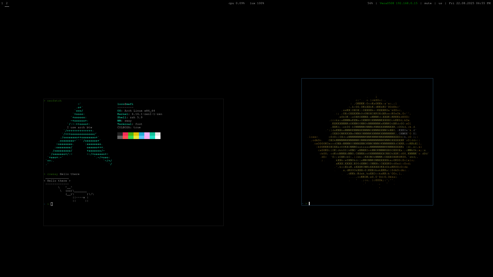
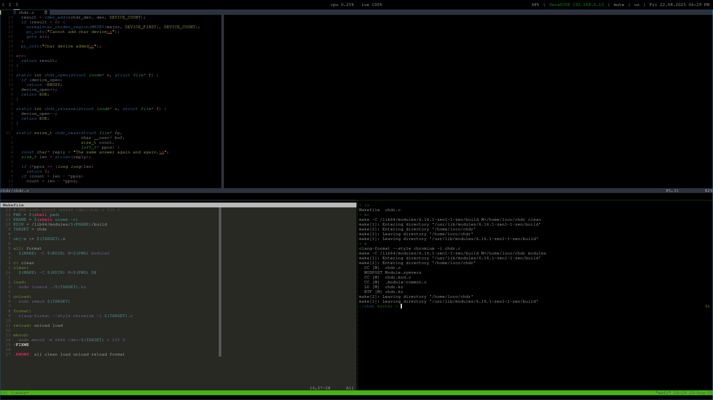
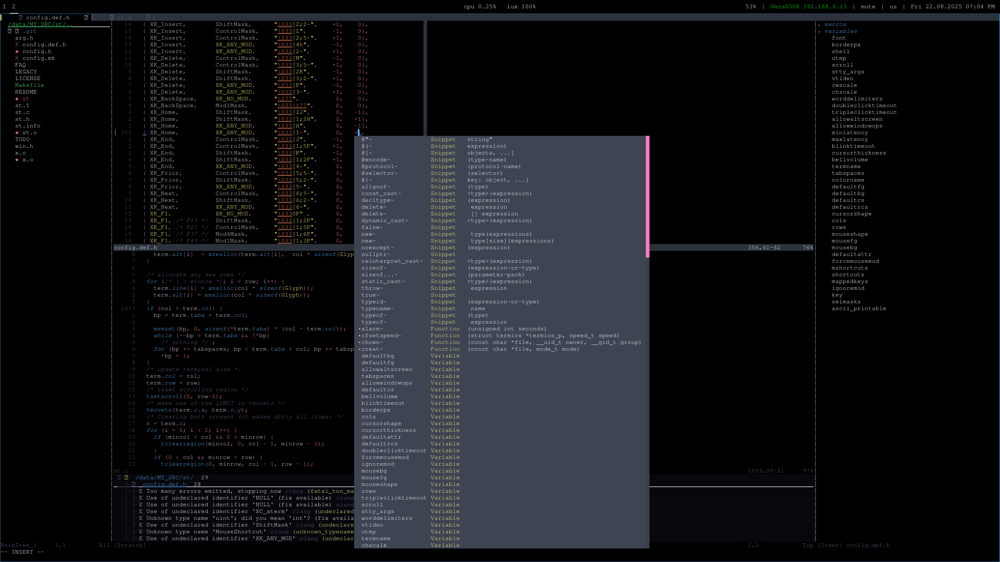

# 
SWAY CONFIG

# About 

 - OS: [**`Arch Linux`**](https://archlinux.org/)
 - Kernel: [**`Linux zen`**](https://github.com/zen-kernel/zen-kernel)
 - WM: [**`Sway`**](https://swaywm.org/)
 - Bar: [**`Waybar`**](https://github.com/Alexays/Waybar)
 - Terminal: [**`Foot`**](https://codeberg.org/dnkl/foot)
 - Shell: [**`Zsh znap`**](https://github.com/marlonrichert/zsh-snap)

# Images Desktop

# About files
#### [bin](bin) - Самописные скрипты, из /usr/local/bin/

#### [sway](config_files/config) - Конфигурация sway wm

#### [docs](docs) - Дерриктория, со изображениями системы

#### [waybar](config_files/waybar) - Конфигурация waybar

#### [foot](config_files/foot.ini) - Конфигурация foot emul

#### [nvim](config_files/init.lua) - Конфигурация Neo vim (Своя конфигурация, будет изменяться)

#### [zshrc](config_files/zshrc) - Конфигурация Zsh & Znap.

#### [vimrc](config_files/vimrc) - Конфигурация vim (Нужен в роли блакнота, чтобы не запускать Neo vim).
